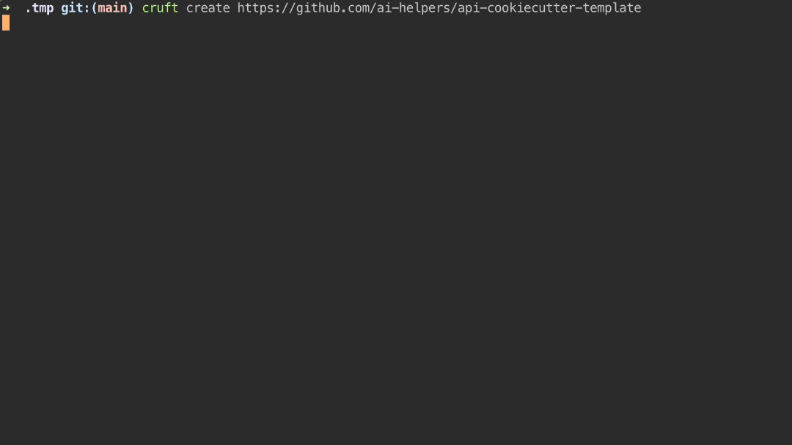

# Cookiecutter API Template based on FastAPI

This template streamlines your FastAPI development, providing a robust foundation built on best practices.

Contributions are welcome!



# Table of Content (ToC)

- [Cookiecutter API Template based on FastAPI](#cookiecutter-api-template-based-on-fastapi)
- [Table of Content (ToC)](#table-of-content-toc)
  - [Main Features](#main-features)
  - [Prerequisites](#prerequisites)
  - [Quickstart](#quickstart)
    - [Without `cruft`](#without-cruft)
    - [With `cruft`](#with-cruft)
    - [Updating Template](#updating-template)
  - [Endpoints](#endpoints)
    - [Health](#health)
    - [Info](#info)
    - [Predict](#predict)
    - [Test](#test)
    - [Documentation](#documentation)
  - [Tests](#tests)
  - [Project Structure](#project-structure)
  - [Contributions](#contributions)


## Main Features

* **Modern Structure:** Organized project layout for easy navigation and scaling.
* **Essential Dependencies:** Includes FastAPI, Uvicorn, Pytest (for testing), and Pydantic (for data validation).
* **Environment Management:** Preconfigured with Poetry for virtual environments and dependency management.
* **API Routing:** Sample `/health` endpoint included.
* **Testing Framework:** Pytest for writing and running automated tests.
* **Linting:** Pre-commit hooks with Black for consistent code formatting.
* **Logging:** Structured logging with Loguru for better debugging and monitoring.

See [here](https://github.com/ai-helpers/example-api-template) an example for project instantiation.

## Prerequisites

Ensure you have the following tools installed:

* **Python:** Recommended to use Pyenv for managing multiple Python versions.
* **Pyenv:** For managing multiple Python versions.
* **Cookiecutter:** `pip install cookiecutter`
* **Poetry:** `pip install poetry`
* **(Optional) Cruft:** For managing Cookiecutter templates more efficiently (not strictly required).

## Quickstart

### Without `cruft`

```bash
$ cookiecutter git@github.com:dktunited/dps-ml-databricks-template
  [1/5] project_long_name (My Project): API Example
  [2/5] project_name_dashes (my-project): api-example
  [3/5] project_name_underscores (my_project): api_example
  [4/5] version (0.1.0):
  [5/5] description (My project description):
$ cd api-example
$ poetry install
[...]
Package operations: 44 installs, 0 updates, 0 removals
[...]
$ poetry run api-example
[\2024-05-28 15:58:59,332] {\root} \INFO - \[API] Starting service with version 0.1.0...
[\2024-05-28 15:58:59,332] {\root} \INFO - \[API] Log level set to DEBUG
[\2024-05-28 15:58:59,332] {\api_example.cli} \INFO - \[API] Log level set to DEBUG
[\2024-05-28 15:58:59,332] {\api_example.cli} \INFO - \[API] API service starting on 0.0.0.0:80
[\2024-05-28 15:59:15,529] {\uvicorn.error} \INFO - \Started server process [98569]
[\2024-05-28 15:59:15,529] {\uvicorn.error} \INFO - \Waiting for application startup.
[\2024-05-28 15:59:15,529] {\uvicorn.error} \INFO - \Application startup complete.
[\2024-05-28 15:59:15,534] {\uvicorn.error} \INFO - \Uvicorn running on http://0.0.0.0:80 (Press CTRL+C to quit)
```

### With `cruft`
```bash
$ cruft create https://github.com/ai-helpers/api-cookiecutter-template
  [1/5] project_long_name (My Project): API Example
  [2/5] project_name_dashes (my-project): api-example
  [3/5] project_name_underscores (my_project): api_example
  [4/5] version (0.1.0):
  [5/5] description (My project description):
$ cd api-example
$ poetry install
[...]
Package operations: 44 installs, 0 updates, 0 removals
[...]
$ poetry run api-example
[\2024-05-28 15:58:59,332] {\root} \INFO - \[API] Starting service with version 0.1.0...
[\2024-05-28 15:58:59,332] {\root} \INFO - \[API] Log level set to DEBUG
[\2024-05-28 15:58:59,332] {\api_example.cli} \INFO - \[API] Log level set to DEBUG
[\2024-05-28 15:58:59,332] {\api_example.cli} \INFO - \[API] API service starting on 0.0.0.0:80
[\2024-05-28 15:59:15,529] {\uvicorn.error} \INFO - \Started server process [98569]
[\2024-05-28 15:59:15,529] {\uvicorn.error} \INFO - \Waiting for application startup.
[\2024-05-28 15:59:15,529] {\uvicorn.error} \INFO - \Application startup complete.
[\2024-05-28 15:59:15,534] {\uvicorn.error} \INFO - \Uvicorn running on http://0.0.0.0:80 (Press CTRL+C to quit)
```

### Updating Template

```bash
$ cruft update
Respond with "s" to intentionally skip the update while marking your project as up-to-date or respond with "v" to view the changes that will be applied.
Apply diff and update? (y, n, s, v) [y]: y
Good work! Project's cruft has been updated and is as clean as possible!
```

## Endpoints

### Health
A simple endpoint to check the health of the application.
```http
GET /health
```
Returns a status message indicating the service is up and running.

### Info
Provides information about the application.
```http
GET /info
```
Returns metadata such as version, author, and other relevant details (cf. `data/info.txt`)

### Predict
Endpoint for making predictions based on input data.
```http
POST /predict
```
Accepts a JSON payload with the necessary input data and returns the prediction results.

### Test
Endpoint for testing purposes.
```http
GET /test
```
Returns a test response, useful for debugging and ensuring the endpoint is reachable.

### Documentation
FastAPI provides interactive API documentation.
```http
GET /docs
```
Access the Swagger UI for a user-friendly interface to interact with your API.

```http
GET /redoc
```
Access the ReDoc interface for an alternative documentation style.

## Tests
To run the tests, you need to install the testing dependencies and then execute the test suite. Here are the commands to get started:

```bash
python -m pip install -U pip
python -m pip install -U pytest pytest-cookies
pytest pytest --keep-baked-projects test_cookiecutter.py
```

These commands will ensure that your pip is up to date, install pytest and pytest-cookies for testing, and then run the tests defined in `test_cookiecutter.py`. The --keep-baked-projects flag keeps the generated projects for inspection even after tests are run.

Implementation of these tests in GitHub Actions is straightforward. You can see an example configuration in the `.github/workflows/main.yml` file. This setup ensures that tests are run automatically on each push or pull request, providing continuous integration and ensuring code quality.

## Project Structure

  ├── .github             <- 
  ├── {{cookiecutter.project_name_dashes}}
  │   ├── .github                                         <- Github Actions CICD
  │   ├── data
  │   ├── docs                                            <- Sphinx documentation
  │   ├── src   
  │       └── {{cookiecutter.project_name_underscores}}   <- Core of project
  │   │       ├── endpoints                               <- API endpoints definition
  │   │       ├── settings                                <- settings
  │   │       ├── __init__.py      
  │   │       ├── app.py           
  │   │       ├── cli.py           
  │   │       ├── errors           
  │   │       ├── load_model.py    
  │   │       └── setup_logging.py 
  │   ├── tasks                                           <- Makefile tasks
  │   ├── tests                                           <- tests (units tests, data tests)
  │   ├── .gitignore          
  │   ├── .mypy.ini   
  │   ├── Makefile   
  │   ├── poetry.toml                       
  │   ├── pyproject.toml   
  │   ├── README.md    
  ├── .gitignore  
  ├── .python-version            
  ├── CONTRIBUTING.md            
  ├── cookiecutter.json            
  ├── README.md            
  ├── test_cookiecutter.py            
  └── VERSION

## Contributions

Your contributions are valued! Please feel free to open issues or submit pull requests.

Let me know if you'd like any other sections added!
